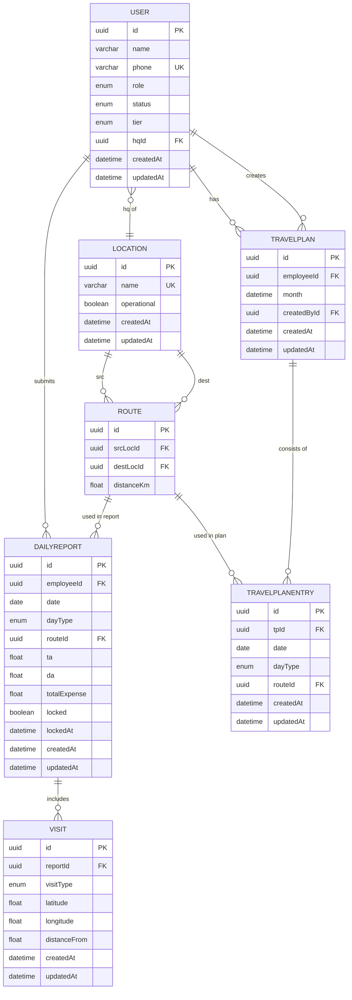

# Database Schema Documentation

> NOTE: AI generated, take this as a grain of salt, schema.prisma and business login are always the source of truth

### MR Travel & Reporting System

> Last Updated: 29th Oct 2025

---

## Table of Contents

- [Overview](#overview)
- [Models & Fields](#models--fields)
  - [User](#user)
  - [Location](#location)
  - [Route](#route)
  - [TravelPlan](#travelplan)
  - [TravelPlanEntry](#travelplanentry)
  - [DailyReport](#dailyreport)
  - [Visit](#visit)
- [Relations](#relations)
- [ER Diagram](#er-diagram)
- [Practical Use-Cases](#practical-use-cases)
- [Improvements & Considerations](#improvements-&-considerations)
- [Indexing & Performance Notes](#indexing-&-performance-notes)
- [Business Logic / Constraints](#business-logic-/-constraints)
- [Change Management & Versioning](#change-management-&-versioning)

---

## Overview

This schema supports a field-sales/travel-reporting system where employees (of different tiers) receive monthly travel plans, submit daily reports, and record visits (to doctors, stockists, chemists).
Key entities include Users, Locations, Routes, TravelPlans & entries, DailyReports, and Visits.

---

## Models & Fields

### User

**Fields**

- `id: String` (PK, UUID)
- `name: String (max length 100)`
- `phone: String` (unique)
- `role: UserRole (EMPLOYEE | ADMIN)`
- `status: UserStatus (ACTIVE | REVOKED)`
- `tier?: EmployeeTier (FSO | TABM | ASM)`
- `hqId?: String` → references `Location.id`
- `createdAt: DateTime`
- `updatedAt: DateTime`

**Relations**

- `travelPlans: TravelPlan[]` (for employees)
- `dailyReports: DailyReport[]` (for employees)
- `plansCreated: TravelPlan[]` (for admins)
- `hq: Location?` (employee’s head-quarter)

---

### Location

**Fields**

- `id: String` (PK, UUID)
- `name: String (VarChar(25), unique)`
- `operational: Boolean` (default true)
- `createdAt: DateTime`
- `updatedAt: DateTime`

**Relations**

- `employees: User[]` (users having this HQ)
- `routeAsSrc: Route[]` (routes where this location is source)
- `routeAsDest: Route[]` (routes where this location is destination)

---

### Route

**Fields**

- `id: String` (PK, UUID)
- `srcLocId: String` → references `Location.id`
- `destLocId: String` → references `Location.id`
- `distanceKm: Float`

**Relations**

- `srcLoc: Location`
- `destLoc: Location`
- `travelPlans: TravelPlanEntry[]` (entries referencing this route)
- `dailyReports: DailyReport[]` (reports referencing this route)

**Constraint**

- Unique on (srcLocId, destLocId)

---

### TravelPlan

**Fields**

- `id: String` (PK, UUID)
- `employeeId: String` → references `User.id`
- `month: DateTime` (represents first of that month/year)
- `createdById: String` → references `User.id` (admin)
- `createdAt: DateTime`
- `updatedAt: DateTime`

**Relations**

- `employee: User`
- `createdBy: User`
- `planEntries: TravelPlanEntry[]`

**Constraint**

- Unique on (employeeId, month)

---

### TravelPlanEntry

**Fields**

- `id: String` (PK, UUID)
- `tpId: String` → references `TravelPlan.id`
- `date: DateTime`
- `dayType: DayType (WORK | HOLIDAY | LEAVE)`
- `routeId?: String` → references `Route.id` (nullable)
- `createdAt: DateTime`
- `updatedAt: DateTime`

**Relations**

- `tp: TravelPlan`
- `route?: Route`

**Constraint**

- Unique on (tpId, date)

---

### DailyReport

**Fields**

- `id: String` (PK, UUID)
- `employeeId: String` → references `User.id`
- `date: DateTime`
- `dayType: DayType (WORK | HOLIDAY | LEAVE)`
- `routeId?: String` → references `Route.id` (nullable)
- `ta?: Float`
- `da?: Float`
- `totalExpense?: Float`
- `locked: Boolean` (default false)
- `lockedAt?: DateTime`
- `createdAt: DateTime`
- `updatedAt: DateTime`

**Relations**

- `employee: User`
- `route?: Route`
- `visits: Visit[]`

**Constraint**

- Unique on (employeeId, date)

---

### Visit

**Fields**

- `id: String` (PK, UUID)
- `reportId: String` → references `DailyReport.id`
- `visitType: VisitType (DOCTOR | STOCKIST | CHEMIST)`
- `latitude: Float`
- `longitude: Float`
- `distanceFrom: Float`
- `createdAt: DateTime`
- `updatedAt: DateTime`

**Relations**

- `report: DailyReport`

---

## Relations

| From Model      | To Model        | Cardinality         | Description                                    |
| --------------- | --------------- | ------------------- | ---------------------------------------------- |
| User (employee) | TravelPlan      | 1 → many            | An employee may have many monthly travel plans |
| User (employee) | DailyReport     | 1 → many            | An employee may submit many daily reports      |
| User (admin)    | TravelPlan      | 1 → many            | An admin creates many travel plans             |
| User (employee) | Location (hq)   | many → 1            | Employee belongs to one HQ location            |
| Location        | User            | 1 → many            | A location is HQ for many employees            |
| Location        | Route (src)     | 1 → many            | Many routes may originate from a location      |
| Location        | Route (dest)    | 1 → many            | Many routes may end at a location              |
| Route           | TravelPlanEntry | 1 → many            | A route may be used in many plan entries       |
| Route           | DailyReport     | 1 → many            | A route may appear in many reports             |
| TravelPlan      | TravelPlanEntry | 1 → many            | A plan consists of many daily entries          |
| TravelPlanEntry | Route           | many → 1 (nullable) | Day entry may reference a route                |
| DailyReport     | Route           | many → 1 (nullable) | Report may reference a route                   |
| DailyReport     | Visit           | 1 → many            | A report may have many visits                  |
| Visit           | DailyReport     | many → 1            | A visit belongs to one report                  |

---

## ER Diagram

## Practical Use-Cases

- **Monthly Travel Plan Generation**
  An administrator selects an employee and a month, creates a `TravelPlan`, then populates `TravelPlanEntry` rows for each day with `dayType` (WORK / HOLIDAY / LEAVE). For WORK days, a `routeId` is assigned so the system knows the route the employee will travel.

- **Employee View of Upcoming Plan**
  An employee queries the `TravelPlan` by their `employeeId` and chosen `month`, then retrieves the associated `planEntries` to display which days are work, leave, or holiday, and on work days which route and distance is planned.

- **Daily Report Submission**
  On a given date (D), the employee creates a `DailyReport`. If `dayType = WORK`, they record the `routeId`, travel allowance (`ta`), daily allowance (`da`), and `totalExpense`. If `dayType = HOLIDAY` or `LEAVE`, those fields remain null or empty.

- **Visit Recording**
  For each `DailyReport` (especially WORK days), the employee logs multiple `Visit` records specifying `visitType` (DOCTOR / STOCKIST / CHEMIST), `latitude`, `longitude`, and `distanceFrom` (e.g., from their HQ or route origin). Later analytics query number and type of visits per employee/day, geographic coverage, and average distance travelled.

- **Report Locking & Review Workflow**
  A manager filters `DailyReport` records where `locked = false`, reviews them, and then sets `locked = true` with `lockedAt` timestamp. This triggers finalisation of expenses and prevents further edits.

- **Analytics & Reporting**
  - Compute for an employee: “How many work-days did I complete this month? How many holidays or leaves?” (by counting `planEntries` with each `dayType`).
  - Compare planned vs actual: “What was the total distance travelled this month?” (sum of `distanceKm` via `Route` for each reported day) vs what was planned.
  - Coverage by visits: “How many doctor visits did employee X make this week/month?” (by filtering `Visit` records) and “What was average distance per visit?” (by averaging `distanceFrom`).
  - Route usage: “Which routes are used most frequently across employees this quarter?” (aggregate `TravelPlanEntry.routeId` and `DailyReport.routeId`).

---

## Improvements & Considerations

- **Conditional constraints**: Some fields should only exist when `dayType = WORK` (e.g., `routeId`, `ta`, `da`, `totalExpense`). Consider adding database check-constraints or enforce via application logic.
- **Date normalization**: Use `@db.Date` or ensure time component is zeroed on `date` / `month` fields to avoid duplicates/time-zone issues.
- **Indexing**: While unique constraints create indexes implicitly, consider additional indexes for frequent filters (for example `DailyReport.locked`, `Visit.visitType`, `Location.operational`).
- **Route enhancements**: If richer planning is needed, consider adding fields such as `estimatedTimeMinutes`, `costEstimate`, or `region` on `Route`.
- **Visit entity links**: If you maintain actual `Doctor`/`Stockist`/`Chemist` entities in the future, add foreign keys (e.g., `doctorId`) and adapt `visitType`.
- **User role enforcement**: Application logic should enforce: if `role = EMPLOYEE`, then `tier` and `hqId` must be non-null; if `role = ADMIN`, they should be null.
- **Archive / partitioning strategy**: For large tables (especially `Visit`), plan for archiving older data or partitioning by year/month to maintain performance.
- **OnDelete behaviour clarity**: Document and review your `onDelete: Restrict` vs `Cascade` decisions. For instance, deleting a user is restricted if they have associated reports/plans.
- **Enum evolution**: When you add new values to enums (e.g., a new `VisitType`), ensure migrations and documentation are planned and executed.
- **Metadata fields**: Consider adding workflow fields like `status`, `approvedBy`, `approvedAt` to `TravelPlan` or `DailyReport` if business rules require approvals.

---

## Indexing & Performance Notes

- Unique constraints provide indexing on:
  - `TravelPlan(employeeId, month)`
  - `TravelPlanEntry(tpId, date)`
  - `DailyReport(employeeId, date)`
- For `Visit`, the foreign key `reportId` is indexed implicitly; if you frequently query by `visitType` or by geographic range (latitude/longitude), consider explicit indexes.
- Add index on `DailyReport.locked` if you often list “pending” reports.
- Add index on `Location.operational` if you filter on `operational = true` often.
- Monitor table sizes: The `Visit` table may grow very large if the field-force is active; consider partitioning or archiving by year/month to preserve query performance.

---

## Business Logic / Constraints

- Only one `TravelPlan` per employee per month (enforced via `@@unique([employeeId, month])`).
- Only one `TravelPlanEntry` per plan per date (`@@unique([tpId, date])`).
- Only one `DailyReport` per employee per date (`@@unique([employeeId, date])`).
- For a `TravelPlanEntry` with `dayType = WORK`, `routeId` must be non-null; for HOLIDAY or LEAVE, `routeId` must be null.
- For a `DailyReport` with `dayType = WORK`, expect `routeId`, `ta`, `da`, `totalExpense` to be populated; for HOLIDAY/LEAVE, those should be null or zero.
- Employees must have `status = ACTIVE` to create plans/reports (enforce via application logic).
- Only operational HQ/locations (`operational = true`) should be used when assigning employees or routes.

---

## Change Management & Versioning

- Maintain a schema version number and update this documentation whenever the schema changes (for example, v1.0 → v1.1).
- Keep migration scripts in your repository, and update this Markdown document _before_ applying schema migrations.
- When adding new fields, tables, or enums, update this Markdown documentation file along with your schema changes.
- Optionally maintain a change log section at the end of this document to note major changes, dates, and authors/owners.

---

## Appendix

**Enum Definitions**

- `UserRole`: EMPLOYEE, ADMIN
- `UserStatus`: ACTIVE, REVOKED
- `EmployeeTier`: FSO, TABM, ASM
- `DayType`: WORK, HOLIDAY, LEAVE
- `VisitType`: DOCTOR, STOCKIST, CHEMIST
- `ReportStatus`: SAVED, LOCKED (if used)

**Mapping to DB Table Names**

- Model `User` → table name `"user"` (via `@@map("user")`)
- Model `Location` → `"location"`
- Model `Route` → `"route"`
- Model `TravelPlan` → `"travelPlan"`
- Model `TravelPlanEntry` → `"travelPlanEntry"`
- Model `DailyReport` → `"dailyReport"`
- Model `Visit` → `"visit"`

---
